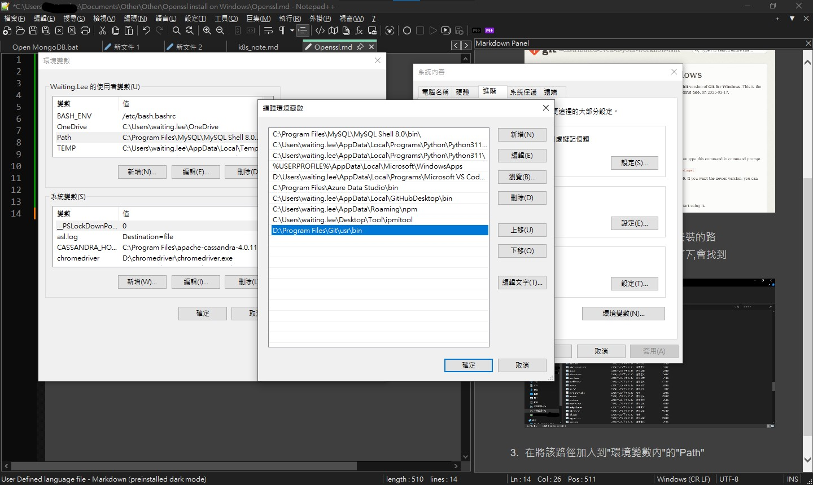
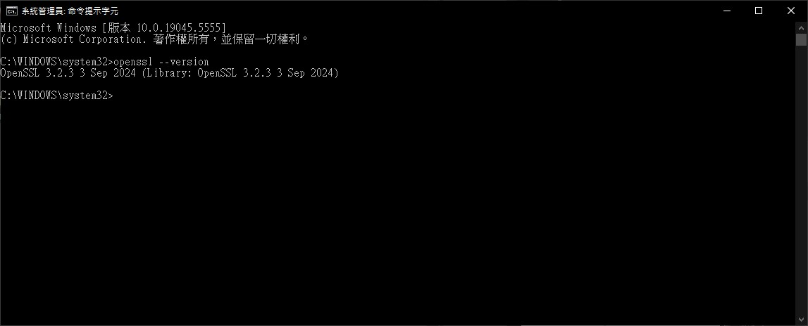

OpenSSL安裝
===

安裝**git指令**
---
由於怕安裝到有問題的第三方軟體,所以就透過git指令內建的Openssl來當作Windows作業系統的openssl

1. 到[Download for Windows](https://git-scm.com/downloads/win)

2.  安裝完成後,到安裝路徑(依照自己安裝的路徑)*"D:\Program Files\Git\usr\bin"底下*,會找到openssl.exe

3. 在將該路徑加入到"環境變數內"的"Path"

4. 可以透過cmd來呼叫openssl,ex: openssl --version
