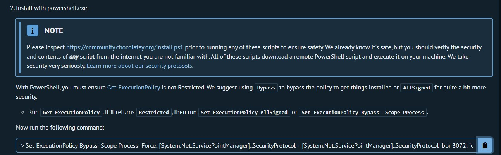
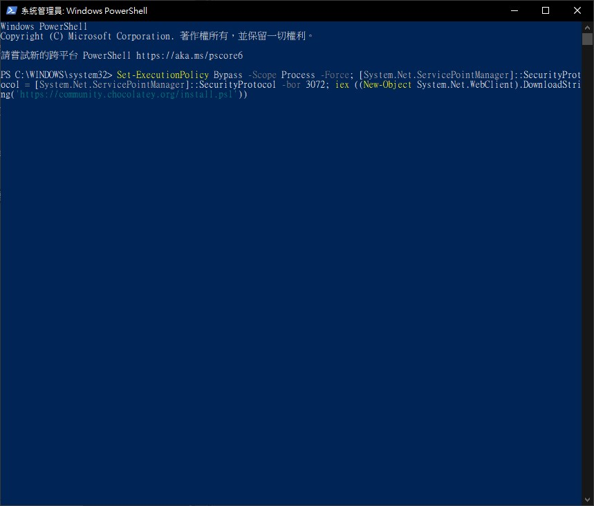
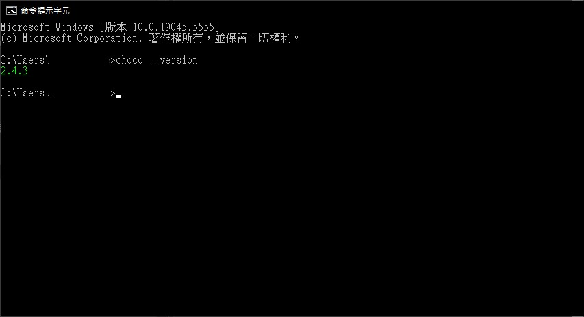

Chocolatey安裝
===
>The Package Manager for Windows Modern Software Automation
> 他是在Windows環境下,Pack Manager,就像Ubuntu底下的apt一樣

---

1. 到[官方網站](https://chocolatey.org/install#individual)

2. 按照操作步驟複製指令,並且以管理員身分啟動Powershell

3. 將該指令複製,並且貼到Powershell上執行,執行完後,就可以使用"choco"

4. 可以透過cmd來呼叫choco,Ex: choco --version
